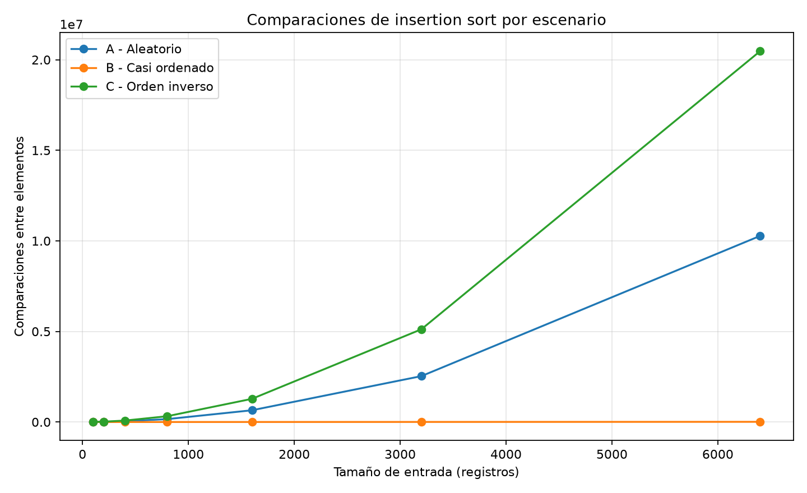
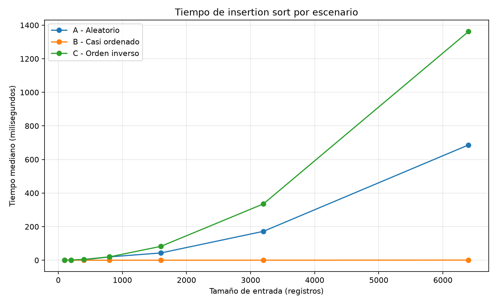

# Laboratorio evaluativo 01 - Fundamentos, complejidad y recurrencias

**Nombre:** Tomás González Zapata

## Reproducción del experimento

Desde la raíz del repositorio, en PowerShell:

```powershell
Set-ExecutionPolicy -Scope Process Bypass
.\venv\Scripts\Activate.ps1
python -m pip install -r requirements.txt
cd lab1-fundamentos-complejidad-recurrencias
python parte3_casos.py
python parte4_complejidad.py
```

Los scripts crean nuevamente las gráficas dentro de `graficas/` y muestran en
la terminal las mediciones usadas en este informe.

## Parte 1 - Analizar el algoritmo antes de comprar hardware

Que insertion sort haya producido durante ocho años una lista ordenada habla de
su **corrección**, pero no garantiza su **eficiencia** para la carga actual. La
corrección responde si los pacientes quedan de mayor a menor riesgo. La
eficiencia responde si ese resultado se obtiene con el tiempo y los recursos
disponibles. Un algoritmo puede ordenar bien y aun así dejar de ser viable al
crecer la entrada.

Tamiza ya no procesa los cerca de 20.000 registros para los que se construyó,
sino 1.200.000. Además, el proceso solo puede ejecutarse entre las 2:00 a. m. y
las 6:00 a. m. Su restricción concreta es una ventana máxima de cuatro horas,
que ya se incumplió al dejar listas parciales. Por eso hay que estudiar cómo
crece el trabajo de insertion sort antes de comprar hardware.

Un servidor con el doble de velocidad puede reducir el tiempo de una ejecución,
pero no cambia el crecimiento cuadrático del algoritmo. Si la cantidad o el
orden de los datos empeoran, el número de operaciones puede crecer mucho más
rápido que la mejora constante del procesador. La compra aplazaría el problema,
pero mantendría la misma causa.

Como segundo ejemplo, una aplicación de comercio electrónico podría buscar de
forma secuencial entre unos 500.000 productos después de cada tecla escrita por
el usuario. La búsqueda puede devolver los productos correctos, pero sería
inviable si la interfaz exige responder en menos de 300 milisegundos. En ese
caso, revisar la estructura de búsqueda y el algoritmo aporta más que limitarse
a aumentar la velocidad del servidor.

## Parte 2 - Responsabilidad ambiental y ética

Elegir el algoritmo que corre cada madrugada también determina el uso de
recursos. Más tiempo de CPU implica más tiempo del servidor bajo carga y, por
lo tanto, mayor consumo energético. No hace falta inventar una cifra de vatios
para reconocer la relación. El efecto tampoco ocurre una sola vez: se repite
todas las noches y se acumula durante los años de operación de Tamiza. Mantener
un algoritmo que hace trabajo innecesario aumenta ese consumo acumulado y la
infraestructura requerida para sostenerlo.

La decisión también tiene consecuencias para personas concretas. Primero, si
el proceso no termina, un paciente con riesgo cardiovascular alto puede quedar
fuera de la lista parcial y recibir tarde la llamada para valoración. El costo
principal lo asume el paciente por el retraso en la atención, aunque la
Secretaría también asume el riesgo institucional de prestar un servicio
inoportuno y el equipo técnico debe responder por una decisión previsible.

Segundo, un operador del centro de contacto puede iniciar su jornada con una
lista incompleta o mal priorizada. El operador pierde tiempo revisando casos o
contactando primero a personas de menor riesgo; la Secretaría paga esa pérdida
operativa y los pacientes desplazados en la lista soportan la demora. No es
razonable trasladarles esos costos cuando el origen está en una elección
técnica que puede analizarse y corregirse.

Además, aquí ordenar bien no es un detalle interno. La posición de cada registro
decide quién recibe primero una llamada. La implementación debe preservar el
orden de mayor a menor riesgo y producir una lista completa. Mejorar el tiempo
sin comprobar la corrección podría adelantar pacientes equivocados; conservar
la corrección sin cumplir la ventana podría excluir a quienes más necesitan el
contacto. La responsabilidad ética exige ambas condiciones.

## Parte 3 - Peor, mejor y caso promedio

[Código de la Parte 3](parte3_casos.py) | [Algoritmos](algoritmos.py) |
[Generadores de datos](datos.py)

### Explicación

Para un tamaño fijo `n`, el **peor caso** es el máximo trabajo que realiza el
algoritmo entre todas las entradas posibles de ese tamaño. El **mejor caso** es
el mínimo trabajo dentro del mismo conjunto de entradas de tamaño `n`. El
**caso promedio** es el trabajo esperado al considerar esas entradas bajo una
distribución definida, por ejemplo permutaciones aleatorias con igual
probabilidad. No es una entrada particular, sino un promedio condicionado por
la forma en que suponemos que llegan los datos.

Para autorizar Tamiza usaría principalmente el peor caso. La ventana de cuatro
horas es estricta y el canal de origen puede cambiar sin aviso, así que una
decisión basada solo en el promedio o en el lote favorable no ofrece la garantía
necesaria. El algoritmo elegido debe seguir siendo viable cuando llegue una
entrada del mismo tamaño con el orden más desfavorable.

### Predicción previa

La predicción se fija antes de ejecutar el experimento. Como el orden requerido
es de mayor a menor, el escenario B debería aproximarse al mejor caso: su 98 %
inicial ya está descendente y solo el 2 % final llega desordenado. El escenario
C debería ser el peor caso porque viene completamente ascendente, en el sentido
contrario, y cada clave debe desplazarse hasta el inicio. El escenario A
aleatorio debería aproximarse al caso promedio, con más trabajo que B y menos
que C.

### Resultados experimentales

Se usaron tamaños de 100, 200, 400, 800, 1600, 3200 y 6400. Para
cada combinación se generó primero el lote y luego se midieron únicamente tres
llamadas a `insertion_sort` con `time.perf_counter()`. La tabla y la gráfica de
tiempo usan la mediana de esas tres ejecuciones para reducir el ruido del
sistema operativo. El conteo de comparaciones es determinista para cada lote.

La situación describe riesgos enteros entre 0 y 1000, pero no pueden existir
6400 valores enteros distintos en ese rango. Para mantener la exigencia de
valores únicos se usaron identificadores enteros de `0` a `n - 1`. Sus
magnitudes no representan riesgos clínicos reales; solo conservan el orden
relativo necesario para estudiar los algoritmos.

Comparaciones entre elementos:

| Tamaño | A: aleatorio | B: casi ordenado | C: inverso |
|---:|---:|---:|---:|
| 100 | 2.542 | 99 | 4.950 |
| 200 | 9.970 | 201 | 19.900 |
| 400 | 40.436 | 409 | 79.800 |
| 800 | 160.484 | 852 | 319.600 |
| 1600 | 648.481 | 1.843 | 1.279.200 |
| 3200 | 2.533.103 | 4.242 | 5.118.400 |
| 6400 | 10.276.753 | 10.649 | 20.476.800 |



Tiempo mediano en milisegundos:

| Tamaño | A: aleatorio | B: casi ordenado | C: inverso |
|---:|---:|---:|---:|
| 100 | 0,2607 | 0,0122 | 0,5187 |
| 200 | 0,6434 | 0,0135 | 1,1759 |
| 400 | 2,4907 | 0,0426 | 5,0540 |
| 800 | 20,0814 | 0,0663 | 20,1729 |
| 1600 | 43,3196 | 0,1433 | 82,5700 |
| 3200 | 172,0780 | 0,3270 | 335,5795 |
| 6400 | 686,6734 | 0,8218 | 1.362,2286 |



### Contraste con la predicción

El escenario C fue el peor: con 6400 registros alcanzó 20.476.800
comparaciones y 1.362,2286 ms. Corresponde exactamente a
`n(n - 1) / 2`, porque cada elemento nuevo debe atravesar toda la parte ya
procesada. El escenario B fue el mejor, con 10.649 comparaciones y 0,8218 ms
para el mismo tamaño; su prefijo descendente casi no requiere movimientos y el
trabajo adicional se concentra en la cola del 2 %.

El escenario A quedó entre ambos y se aproxima al caso promedio. En `n=6400`
realizó 10.276.753 comparaciones, cerca de la mitad del escenario C, y tardó
686,6734 ms. La clasificación observada coincide con la predicción previa: B
se acerca al mejor caso, A al promedio y C representa el peor caso para el
orden descendente elegido.

## Parte 4 - Complejidad y validación

[Código de la Parte 4](parte4_complejidad.py) | [Algoritmos](algoritmos.py) |
[Generadores de datos](datos.py)

### Recurrencia de merge sort

Merge sort divide una entrada de tamaño `n` en dos partes, ordena cada una y
las combina. Su recurrencia es:

```text
T(n) = 2T(n/2) + Θ(n)
```

El `2` aparece porque se resuelven dos subproblemas. Cada uno recibe `n/2`
elementos. Finalmente, `Θ(n)` corresponde a la mezcla: para producir una sola
lista descendente hay que recorrer los elementos de ambas mitades.

### Resolución por método maestro

Para la forma `T(n) = aT(n/b) + f(n)` se obtiene:

```text
a = 2
b = 2
f(n) = Θ(n)

n^(log_b(a)) = n^(log_2(2)) = n
```

Por tanto, `f(n) = Θ(n)` tiene el mismo orden que
`n^(log_b(a)) = n`. Se cumple la condición del caso 2 del método maestro:
`f(n) = Θ(n^(log_b(a)) log^0(n))`. Al sumar un factor logarítmico, el
resultado es:

```text
T(n) = Θ(n^(log_2(2)) log(n))
T(n) = Θ(n log n)
```

### Análisis línea a línea de insertion sort

El análisis corresponde a las operaciones de `insertion_sort` en
[`algoritmos.py`](algoritmos.py). Para la iteración externa `i`, sea `t_i` el
número de comparaciones entre elementos y `s_i` el número de desplazamientos.
También sea `b_i` igual a 1 cuando esa iteración termina con `break` y 0 cuando
termina porque `posicion` llega a -1.

| Operación real | Costo | Veces que se ejecuta |
|---|---:|---:|
| `ordenados = datos.copy()` | `c1` por elemento | `n` |
| `comparaciones = 0` | `c2` | `1` |
| control de `for indice in range(...)` | `c3` | `n` |
| `clave = ordenados[indice]` | `c4` | `n - 1` |
| `posicion = indice - 1` | `c5` | `n - 1` |
| comprobación `posicion >= 0` | `c6` | como máximo `Σ(t_i + 1)` |
| `comparaciones += 1` | `c7` | `Σt_i` |
| comparación `ordenados[posicion] >= clave` | `c8` | `Σt_i` |
| `break` | `c9` | `Σb_i` |
| desplazamiento de un elemento | `c10` | `Σs_i` |
| `posicion -= 1` | `c11` | `Σs_i` |
| inserción `ordenados[posicion + 1] = clave` | `c12` | `n - 1` |
| `return ordenados, comparaciones` | `c13` | `1` |

Una expresión que reúne esos costos es:

```text
T(n) = c1*n + c2 + c3*n + (c4+c5+c12)(n-1)
     + c6*Σ(t_i+1) + (c7+c8)*Σt_i
     + c9*Σb_i + (c10+c11)*Σs_i + c13
```

En el peor caso, la entrada viene ascendente y se necesita el resultado
descendente. En la iteración `i`, la clave se compara y se desplaza frente a
los `i` elementos anteriores: `t_i = s_i = i`. Así aparece la suma:

```text
1 + 2 + ... + (n - 1) = n(n - 1) / 2
```

Ese término cuadrático domina los costos lineales, por lo que el peor caso es
`Θ(n²)`. En el mejor caso la entrada ya está descendente: se hace una
comparación entre elementos por iteración, no hay desplazamientos y
`Σt_i = n - 1`. Incluso contando la copia inicial, el costo total es `Θ(n)`.
En una permutación aleatoria se desplaza en promedio una fracción lineal del
prefijo por cada clave; la suma sigue siendo cuadrática y da `Θ(n²)`.

### Tabla de complejidades

| Algoritmo | Mejor caso | Caso promedio | Peor caso |
|---|---:|---:|---:|
| Insertion sort | `Θ(n)` | `Θ(n²)` | `Θ(n²)` |
| Merge sort | `Θ(n log n)` | `Θ(n log n)` | `Θ(n log n)` |

### Validación experimental

La comparación medida entre ambos algoritmos se presenta en el siguiente
avance.
