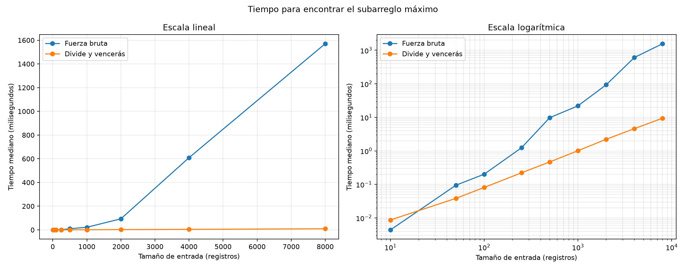

# Laboratorio evaluativo 02 - Divide y vencerás

**Nombre:** Tomás González Zapata

## Reproducción

Desde la raíz del repositorio, en PowerShell:

```powershell
Set-ExecutionPolicy -Scope Process Bypass
.\venv\Scripts\Activate.ps1
cd lab2-divide-y-vencer
python pruebas.py
python medicion.py
```

El entorno virtual de la raíz contiene matplotlib. `pruebas.py` verifica las
dos soluciones y `medicion.py` repite el experimento y genera la gráfica en
`graficas/tiempo_vs_n.png`.

## Parte 1 - Implementación y verificación

[Algoritmos de subarreglo máximo](subarreglo.py) |
[Pruebas](pruebas.py)

La solución de fuerza bruta extiende cada inicio posible y acumula la suma al
avanzar, sin recalcular el tramo. La solución de divide y vencerás separa el
rango, resuelve ambas mitades y compara sus resultados con la mejor racha que
cruza el punto medio.

`pruebas.py` verificó la serie de ocho días con suma 17, un solo elemento,
series completamente negativas y positivas, un máximo cruzado, empates y
decimales. Además comparó las sumas de ambos algoritmos en 40 listas aleatorias
reproducibles. En todos los casos los índices concordaron con la suma reportada
y las listas originales permanecieron intactas.

## Parte 2 - Medición y gráfica

[Código de la medición](medicion.py)

Los datos se generaron con semilla fija y valores enteros entre -100 y 100,
antes de iniciar el cronómetro. Ambos algoritmos recibieron exactamente la
misma lista para cada tamaño. Se midieron tres ejecuciones con
`time.perf_counter()` y se usó la mediana para reducir el ruido del sistema
operativo. El propio experimento comprobó que las sumas coincidieran.

| Tamaño | Fuerza bruta (ms) | Divide y vencerás (ms) | Suma máxima |
|---:|---:|---:|---:|
| 10 | 0,0044 | 0,0087 | 153 |
| 50 | 0,0947 | 0,0384 | 323 |
| 100 | 0,2016 | 0,0811 | 327 |
| 250 | 1,2390 | 0,2215 | 986 |
| 500 | 9,7666 | 0,4677 | 2.984 |
| 1000 | 21,9804 | 1,0097 | 1.885 |
| 2000 | 93,3190 | 2,2149 | 4.856 |
| 4000 | 608,9839 | 4,6039 | 3.374 |
| 8000 | 1.570,6284 | 9,4396 | 6.360 |



La figura presenta los mismos datos en escala lineal y logarítmica. La segunda
vista permite distinguir la curva de divide y vencerás, que en la escala lineal
queda cerca del eje por la diferencia de tiempos.

## Parte 3 - Análisis

### 1. Recurrencia

`subarreglo_maximo` crea dos subproblemas de tamaño aproximado `n/2`: el mejor
tramo de la mitad izquierda y el de la derecha. `suma_cruzada` barre una vez
desde el centro hacia ambos extremos, por lo que combinar cuesta `Θ(n)`. Así,
`T(n) = 2T(n/2) + Θ(n)`. En el método maestro, `a=2`, `b=2` y
`f(n)=Θ(n)`. Como `n^(log_b(a)) = n^(log_2(2)) = n`, `f(n)` tiene el mismo
orden y se cumple el caso 2. Por tanto, `T(n)=Θ(n log n)`.

Fuerza bruta ejecuta el ciclo interno `n`, `n-1`, ..., `1` veces. La suma es
`n(n+1)/2`; su término dominante es `n²`, de modo que el costo es `Θ(n²)`.

### 2. Lo medido contra lo esperado

La curva cuadrática se separa cada vez más. De 1000 a 2000 registros, fuerza
bruta pasó de 21,9804 a 93,3190 ms: se multiplicó por 4,25, cerca del factor 4
esperado al duplicar `n` en `Θ(n²)`. Divide y vencerás pasó de 1,0097 a
2,2149 ms, un factor 2,19. Para `n log n`, duplicar desde 1000 predice un factor
cercano a `2 log2(2000)/log2(1000) = 2,20`, coherente con lo observado. El
factor cuadrático entre 4000 y 8000 fue solo 2,58, evidencia del ruido que
también justifica usar medianas y más de una base al extrapolar.

### 3. Tamaños pequeños

Con 10 registros, fuerza bruta ganó: 0,0044 frente a 0,0087 ms. Divide y
vencerás empezó a ganar en el siguiente tamaño medido, 50 registros, con
0,0384 frente a 0,0947 ms. Antes del cruce, las llamadas recursivas y la mezcla
pesan más que la ventaja asintótica; luego el crecimiento cuadrático domina.

### 4. Cuándo conviene dividir

Para hallar solo el máximo de un arreglo, dividir produce dos máximos parciales
y combinarlos cuesta `Θ(1)`: `T(n)=2T(n/2)+Θ(1)=Θ(n)`. Un recorrido simple
también es `Θ(n)` y usa menos llamadas y estado auxiliar. Dividir no mejora el
orden de crecimiento porque no evita revisar cada elemento; resulta útil cuando
la división reduce trabajo repetido o permite una combinación que supera al
método directo, como ocurre con el subarreglo máximo.

### 5. Concepto para la gerente

Recomiendo divide y vencerás como solución única. Para historiales de 2000 días
midió 2,2149 ms, frente a 93,3190 ms de fuerza bruta, y la brecha aumenta con
el tamaño. Para un millón de registros hice estimaciones, no mediciones
directas. Desde `n=4000`, el modelo cuadrático estima 10,5726 horas y, desde
`n=8000`, 6,8170 horas para fuerza bruta. La diferencia muestra la sensibilidad
al tiempo base, pero ambas cifras son demasiado altas. Aplicando el modelo
`n log n`, divide y vencerás da 1,9172 segundos desde 4000 y 1,8139 segundos
desde 8000. Esta cercanía ofrece más confianza, aunque el cálculo supone el
mismo equipo, distribución de datos y ausencia de carga externa. Para las
series futuras de sensores, la solución recursiva conserva un margen mucho más
razonable.
